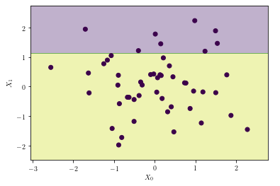

## Visualizing a Decision Tree
Once we have created a decision tree using sklearn, we can easily visualize it by exporting the tree in Graphviz format, using Graphviz open source graph visualization software.

## export_graphviz
Use `sklearn.tree.export_graphviz()` to export the tree into DOT(https://www.graphviz.org/doc/info/lang.html) format. DOT is GraphViz's text file format. It includes human-readable syntax that describes the appearance of the tree graph, including the content of subtrees and the appearance of nodes (i.e. color, width, label).

So for example, assume `model` is an instance of `DecisionTreeClassifier()`, and you've already called `model.fit()`. Then export to DOT format as follows:
```
dot_data = export_graphviz(model)
```
There are a lot of options you can specify at this step, which you can explore in the documentation here(https://scikit-learn.org/stable/modules/generated/sklearn.tree.export_graphviz.html). In particular, you can save the data to a file, you can specify whether and how to label the nodes, and you can rotate the tree.

graphviz.Source
To render a ready-made DOT source code string, create a Source object holding your DOT string.
```
from graphviz import Source
graph = graphviz.Source(dot_data) 
```

Then, display the graph directly in the Jupyter notebook:
```
graph
```
## Example
So, for example, if we create the following small dataset,

```
rng = np.random.RandomState(0)
X = rng.normal(size=(50, 2))
```
and set a target variable, yy, equal to 0 by default, and equal to 1 if X_1 > 1.2X 
1 > 1.2,
```
y = np.zeros(X.shape[0], dtype=np.int)
y[X[:, 1] > 1.2] = 1
```

and fit a tree to it,

```
tree = DecisionTreeClassifier().fit(X, y)
```
we can run the following code,

```
from sklearn.tree import export_graphviz
from graphviz import Source

treedot = export_graphviz(tree, out_file=None)
treegraph = Source(treedot)
treegraph
```