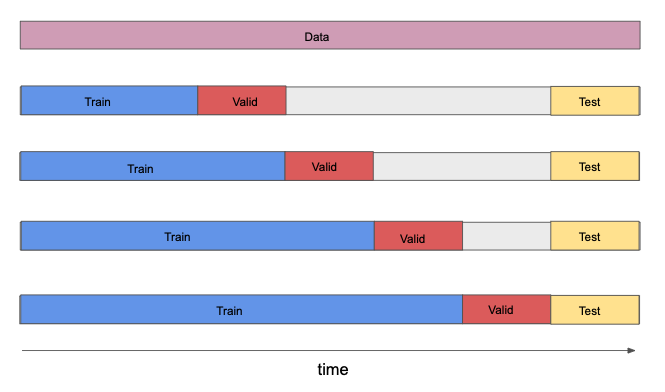

## Cross Validation for Time Series
Methods for choosing training, testing and validation sets for time-series data work a little differently than the methods described so far. The main reasons we cannot use the previously described methods exactly as described are,

1. We want our validation and testing procedure to mimic the way our model would work in production. In production, it's impossible to train on data from the future. Accordingly, training on data that occurred later in time than the validation or test data is problematic.
1. Time series data can have the property that data from later times are dependent on data from earlier times. Therefore, leaving out an observation does not remove all the associated information due to correlations with other observations.
How do we modify cross validation procedures to treat time-series data? A common method is to divide the data in the following manner:

This way, each training set consists only of observations that occurred prior to the observations that form the validation set. Likewise, both the training and validation sets consist only of observations that occurred prior to the observations that form the test set. Thus, no future observations can be used in constructing the forecast.