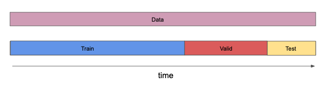

## Validation for Financial Data
Furthermore, when working with financial data, we can bring practitioners' knowledge of markets and financial data to bear on our validation procedures. We know that since markets are competitive, factors decay over time; signals that may have worked well in the past may no longer work well by the current time. For this reason, we should generally test and validate on the most recent data possible, as testing on the recent past could be considered the most demanding test.

It's possible that the design of the model may cause it to perform better or worse in different market regimes; so the most recent time period may not be in a market regime in which the model would perform well. But generally, we still prefer to use most recent data to test if the model would work in the time most similar to the present. In practice, of course, before investing a lot of money in a strategy, we would allow time to elapse without changing the model, and test its performance with this true out-of-sample data: what's known as "paper trading".

In summary, most common practice is to **keep a block of data from the most recent time period as your test set.**

Then, the data are split into train, valid and test sets according to the following schematic:

When working with data that are indexed by asset and day, it's important not to split data for the same day, but for different assets, among sets. This would manifest as a subtle form of lookahead bias. For example, say data from Coca-Cola and Pepsi for the same day ended up in different sets. Since they are very similar companies, one might expect their share price trends to be correlated. If the model were trained on data from one company, and then validated on data from the other company, it might "learn" about a price movement that affects both companies, and therefore have artificially inflated performance on the validation set.