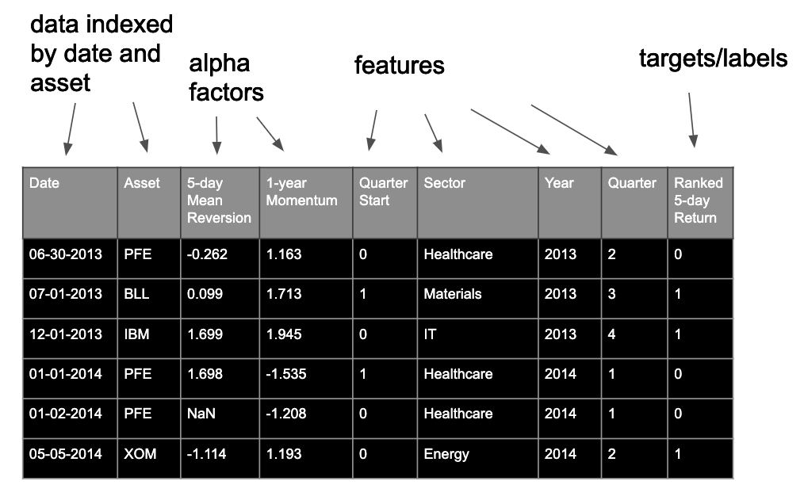
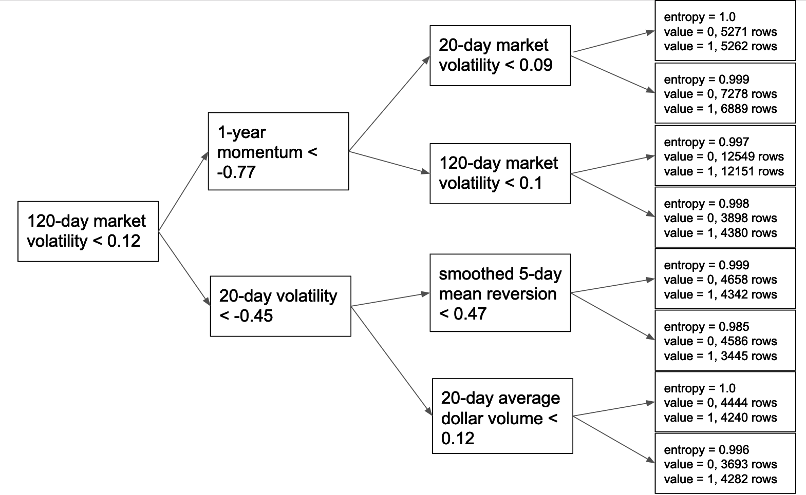

## Random Forests for Alpha Combination
So we've seen how random forests are used for certain problems, like predicting a consumer's app preference from personal data. How do we use random forests for alpha combination?

An example alpha combination data subset.

For this type of problem, we have data that look like the above. Each row is indexed by both date and asset. We typically have several alpha factors, and we then calculate "features", which provide the random forest model additional information. For example, we may calculate date features, which the algorithm could use to learn that certain factors are particularly predictive during certain periods.

An example alpha combination tree.

What are we trying to predict? We're trying to predict asset returns—but not their decimal values! We rank them relative to each other into only two buckets, such that we essentially predict winners and losers on the day. The next lesson is all about feature engineering, so let's move on to learn more about features and labels in more detail!