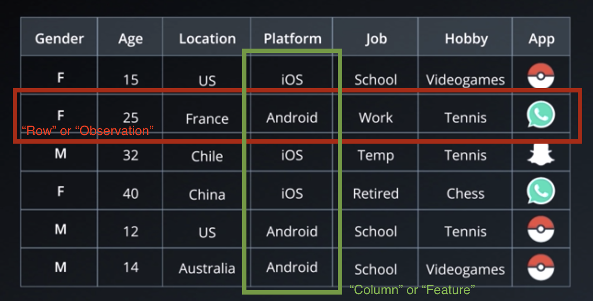

## Ensemble Methods
Great, so now that you’ve learned about decision trees, let’s learn about some new methods for making them more powerful. The idea is actually quite simple: we’re going to combine several weaker models (in this case, individual decision trees) together to make a more powerful model. The constituent models are called weak learners, while the combined model is called the strong learner. Combining many models together to yield a more powerful model is called ensembling.

A key part of ensembling, though, is that the constituent models are not the same. In fact, ensembles tend to yield better results when the constituent models are very different. So how do we use the same dataset to grow many different trees? Well, there are actually many ways. Let’s discuss a few of the most commonly used ones.

* For every tree, create a new dataset by drawing a random subset of rows from the original dataset. Train the tree on this new dataset.
* For every tree, create a new dataset by drawing a random subset of rows from the original dataset with replacement. Train the tree on this new dataset.
* For every tree, create a new dataset by drawing a random subset of columns from the original dataset. Train the tree on this new dataset.

These are examples of "perturbations"—ways to "shake up" the constituent trees in order to ensure that they are different from each other. These are all examples of ways to introduce “perturbations” randomly and independently. In contrast, there's another class of methods where perturbations (on a given training set) are chosen deterministically and serially, with the nth perturbation depending strongly on all of the previously generated rules. So that we have more time to talk about the random and independent methods, we’re not going to talk more about the deterministic and serial methods for now.